# GigConnect - A Hyperlocal Freelance Marketplace

<h1>Problem Statement:</h1>

To create a streamlined platform that connects local communities with skilled
freelancers, enabling clients to easily find and hire local talent for specific services while providing
freelancers with a platform to showcase their skills and find nearby job opportunities

<h1>Use Case:</h1>

Develop a mobile-responsive web application where users can register as either a client or a
freelancer. Clients can post job listings (gigs), search for freelancers based on skill and location, and
manage payments securely. Freelancers can create detailed profiles, browse and apply for local gigs, and
communicate with clients directly through the platform

<h1>Key Modules:</h1>
<ul>
  <li>Dual-Role User Authentication: Secure registration and login for both "Client" and "Freelancer" roles using JWT</li>
  <li>Freelancer Profile Management: Detailed profiles with skills, portfolio, service rates, and user reviews.</li>
  <li>Gig Posting & Management: Clients can create, edit, and manage job postings with clear requirements.</li>
  <li>Advanced Search & Filtering: Hyperlocal search functionality with filters for skills, location, price range, and ratings.</li>
  <li>Real-time Messaging System: Integrated chat for seamless communication between clients and freelancers.</li>
  <li>Review & Rating System: A two-way feedback system to build trust and reputation.</li>
  <li>Secure Payment Integration: Integration with Razorpay/Stripe for secure transactions and milestone payments.</li>
</ul>

<h1>Application Screenshots</h1>

The following images showcase the application:

  
  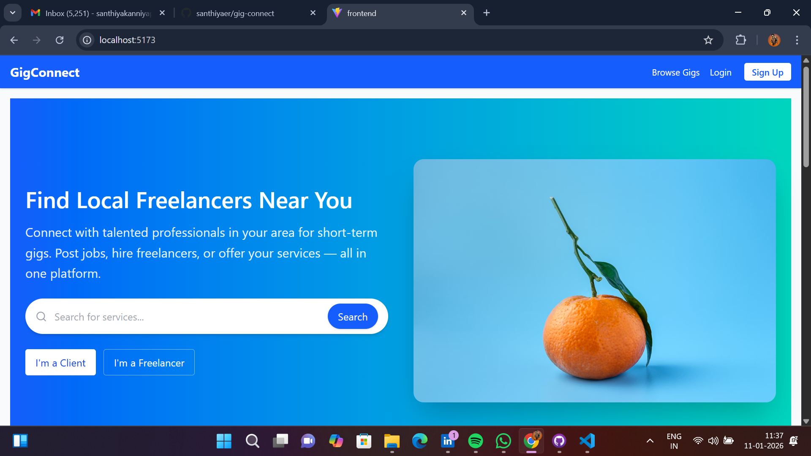
  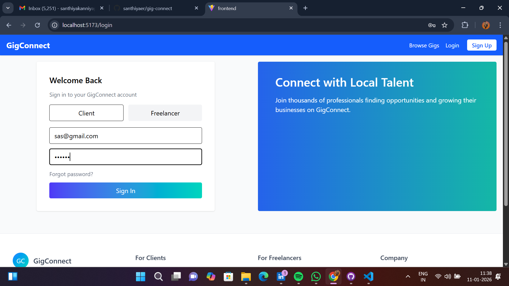
  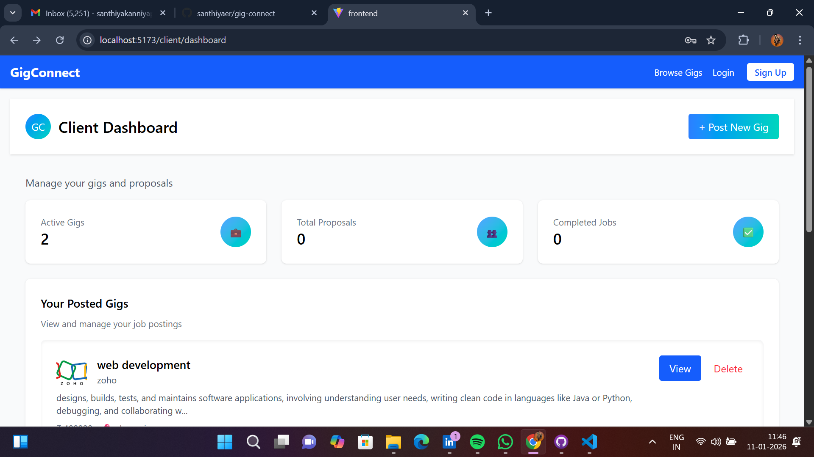
  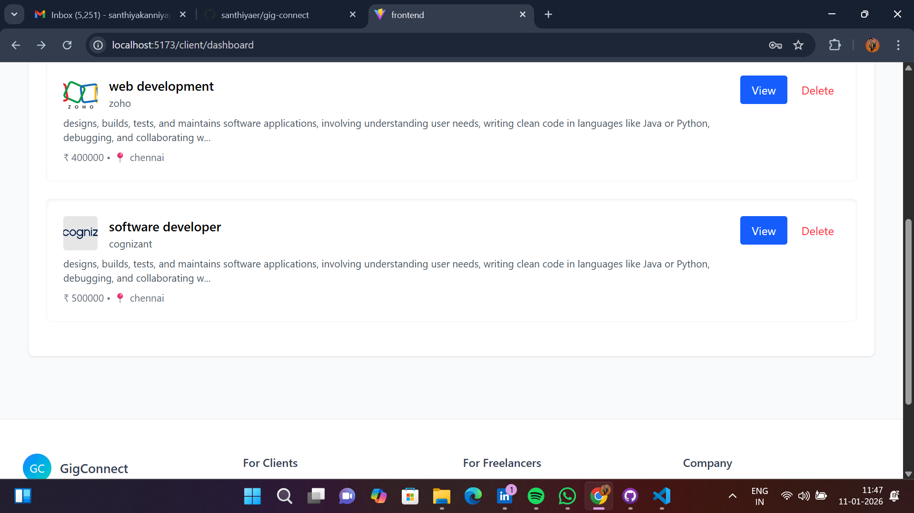
  
  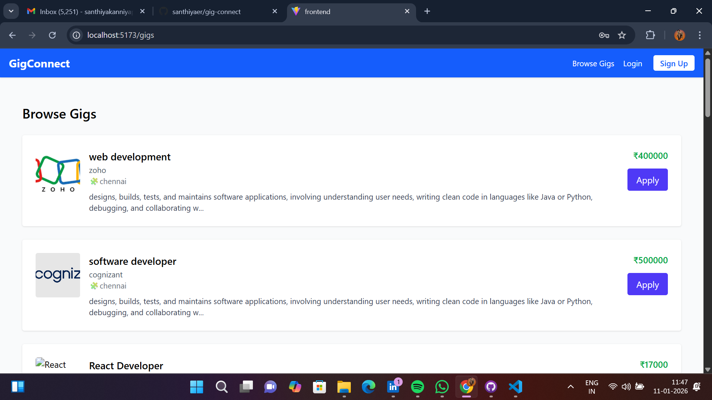
  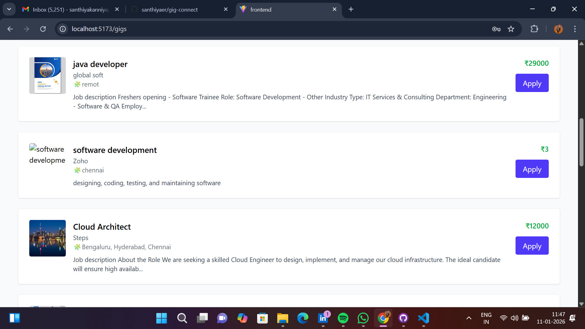
  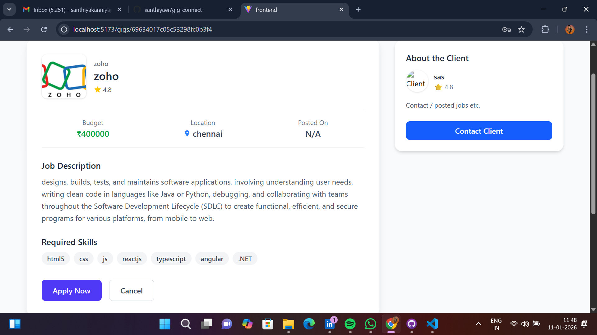
  
  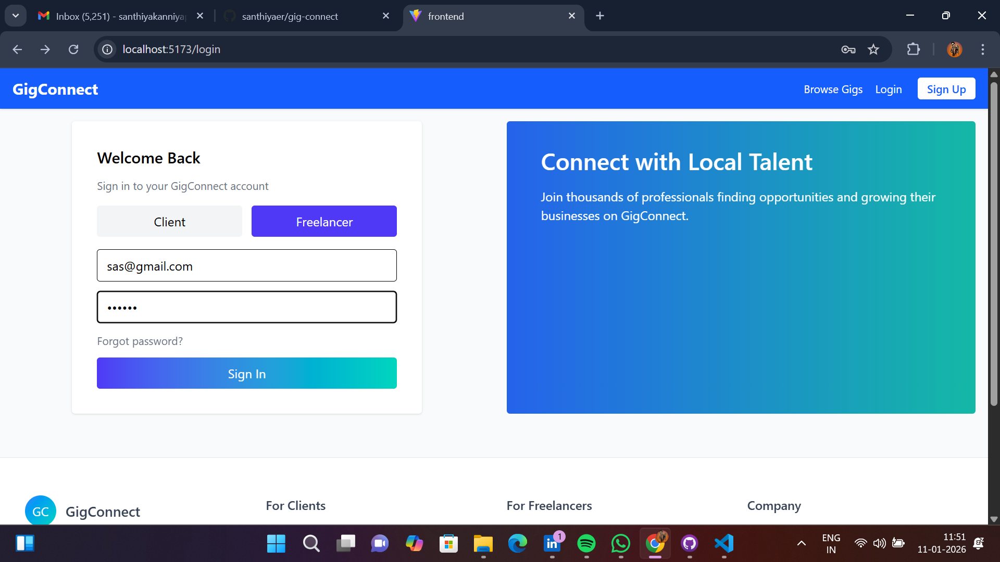
  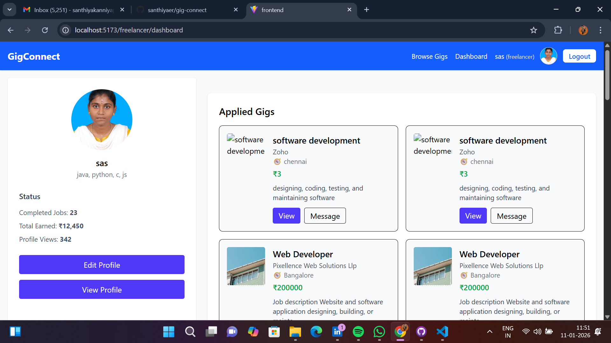
  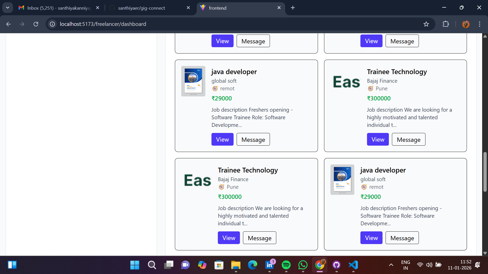
  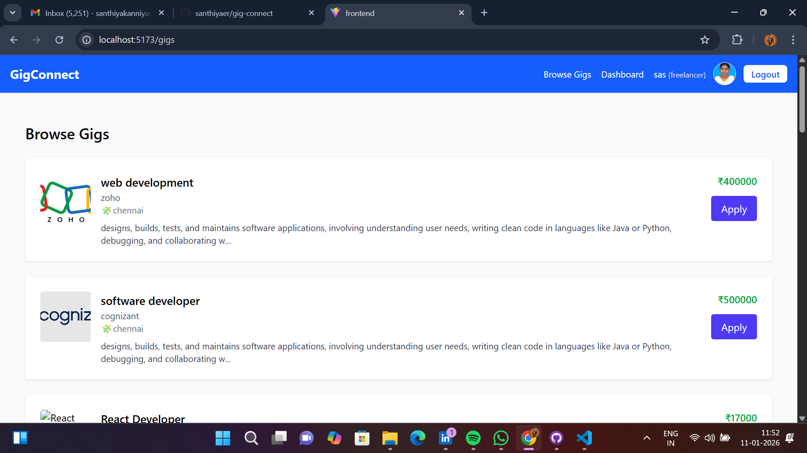
  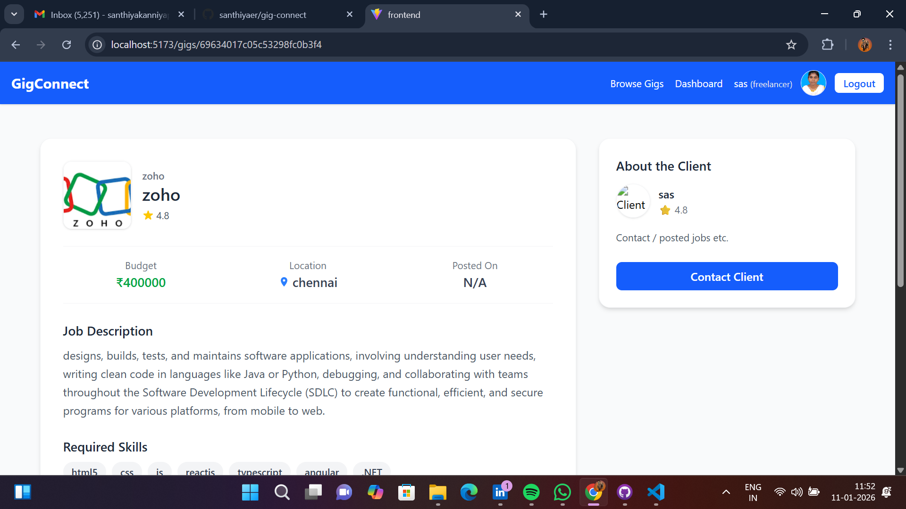
  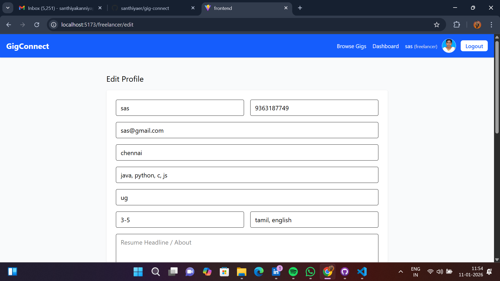
  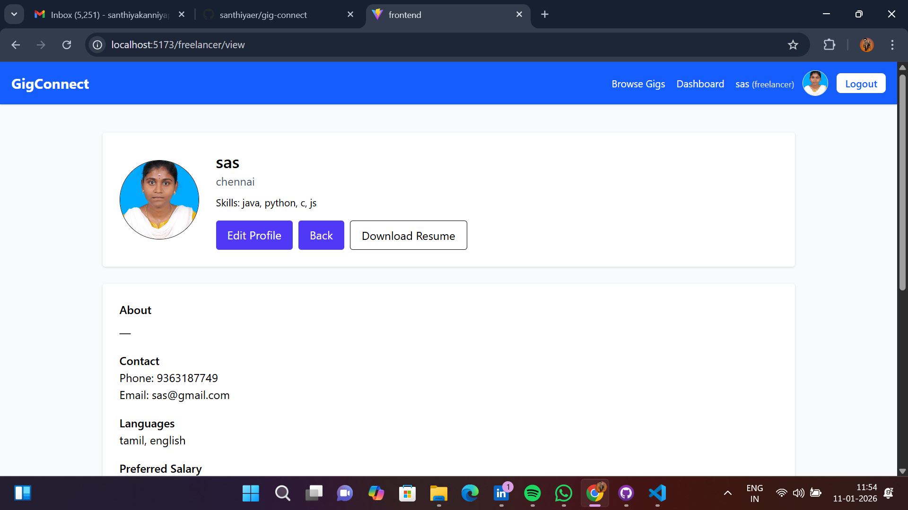

